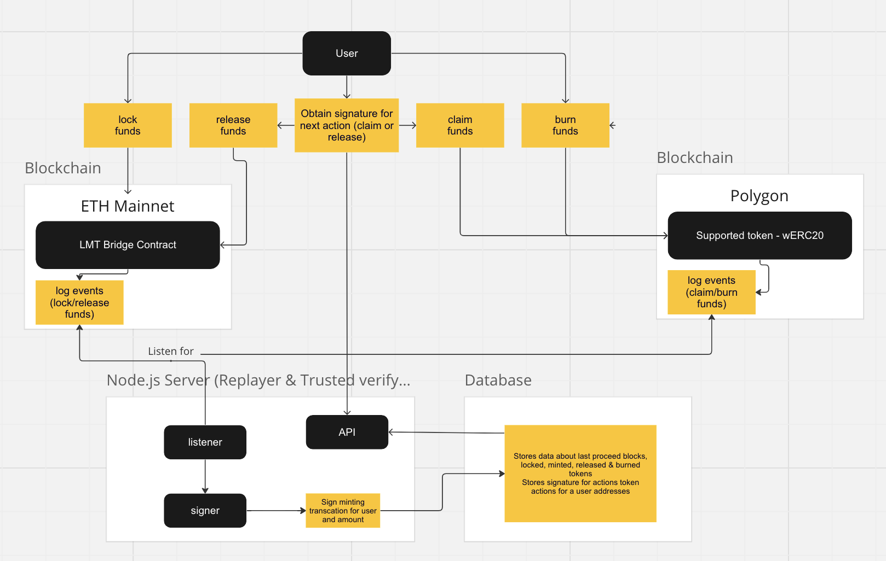

# Simple EVM Token Bridge with BЕ

## Description

The goal of this project is to create an EVM Token bridge. It should allow users to bridge any ERC-20 token between two EVM compatible networks.
Acceptance Criteria:
Technological Level with Smart Contracts (Hardhat project)
Minimum 3 contracts:
One contract for the bridge itself
Two contracts for ERC-20 token -> One generic and one wrapped
Unit tests for the bridge contract with > 95% code coverage
Events need to be emitted on each major action from the contracts
Deployment Scripts:
Automatic deployment scripts for desired testnets
Technological level with dApp

## CLI

A simple CLI tool must be created that will interact with the contracts and act as an interface for the bridge.
Simple commands should be supported such as:
lock - receives a target ERC-20 token address and amount to be locked (bridged)
claim - claim an amount of locked tokens from a source chain
burn - burn tokens from the target chain before releasing them to the source
release - release tokens from the target network to the source
Event Listener Service (Indexer)
Indexer should be able to read blocks from a starting point(block)
Indexer should be able to continue from the last processed block when it’s restarted
Indexer should be able to listen for events emitted by the contract
TokenLocked
TokenClaimed
TokenReleased
TokenBurned
Indexer should be able to parse these events
Parsed events should be stored in DB

## API

All endpoints should have proper input validation and error handling
API endpoint for fetching all tokens waiting to be claimed (TokenLocked event)
API endpoint for fetching all tokens waiting to be released
API endpoint for fetching all bridged tokens by wallet address
API endpoint for fetching all bridged ERC-20 tokens

# Project documentation

## Diagram

**The project consists of:**

## Web3

1. **Hardhat Project**:
   - **LMTBridge.sol**: This contract is responsible for locking and unlocking funds on the source chain, adding new supported tokens from a trusted actor for the system, and emitting events for these actions.
   - **LMT.sol**: This is a simple ERC20 contract implementation used for testing purposes in this project.
   - **wERC20.sol**: This is a base contract for all supported tokens on the destination chain. Each supported token from the source should have a corresponding wrapped version on the destination chain.
   - **Tests**: This directory covers all the main functionalities of the system.

## Web2

1. **Node.js Server**:

   - This server acts as a relayer, listening for events on both the source and destination chains. It signs a typed hashed signature from the trusted role, which users can use to mint/unlock their tokens.
   - It provides API endpoints to obtain information about tokens waiting to be claimed or released, among other functionalities.

2. **Firebase DB**:

   - This is a simple database that stores event information, such as supported tokens and actors who have used the system. It ensures that if the server is restarted, events are not processed twice.
   - It also stores action signatures of users, which can be used only once.

3. **Simple CLI**:
   - The CLI provides a straightforward way to interact with the project's protocol.
   - For the purposes of this project, the CLI works with a hardcoded address because it can't use Metamask or other wallet providers, as it doesn't run in a browser environment.

---

